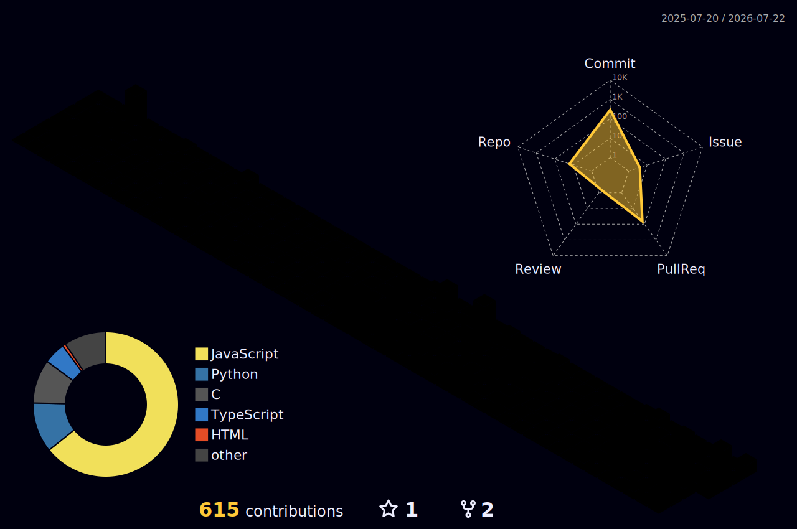

<!-- <div align="center">

# Hi, I'm Satyam Diwaker 👋


<br>


</div>

---

## About Me

* 🎓 B.Tech Student
* 🛡️ Interested in Cybersecurity and Threat Detection
* 💻 Building projects with TypeScript, Python, Java, and Web Technologies
* 🌱 Currently learning SIEM, SOC workflows, and Advanced DSA
* 🚀 Exploring AI-powered security applications

---
## Tech Stack

<p align="center">
  
</p>

---

## Featured Project

### PhishGuard

AI-assisted phishing detection and threat analysis platform.

**Tech Stack:** Python • FastAPI • NestJS • MySQL • C • C++

**Highlights**

* URL and phishing detection workflows
* Backend APIs using NestJS & FastAPI
* Dashboard and monitoring interface
* Ongoing development and experimentation

🔗 Repository:
https://github.com/Satyamdiwaker000001/PhishGuard

---

## GitHub Stats

<div align="center">


</div>

<br>

## Development Activity

<p align="center">
  
</p>

---


## Journey

```text
2024
│
├─ Started Java & Web Development
│
2025
│
├─ Built Full-Stack Projects
├─ Learned React & NestJS
│
2026
│
├─ AI Agents
├─ RAG Applications
├─ PhishGuard Development
│
Next
│
├─ SIEM & Cybersecurity Labs
├─ SOC Projects
├─ Cloud Security
└─ Security Automation
```

## Connect

<p align="center">
  <a href="https://github.com/Satyamdiwaker000001">
    
  </a>

  <a href="https://www.linkedin.com/in/satyam-diwaker-71139b2b3/">
    
  </a>

  <a href="satyamdiwaker863@gmail.com">
    
  </a>
</p>

<div align="center">
  <sub>Always learning, building, and improving.</sub>
</div> -->


<div align="center">



<br/>

<a href="https://git.io/typing-svg">
  
</a>

<br/>

[](https://www.linkedin.com/in/satyamdiwaker-71139b2b3)
[](mailto:satyamdiwaker863@gmail.com)
[](https://github.com/satyamdiwaker000001)

</div>

<br/>

## Introduction

I'm a Computer Science undergraduate building responsive, full-stack web applications —
React on the front end, Node.js and FastAPI on the back end, SQL underneath. My current
project scores links for malicious intent in real time, with an AI model being integrated
to sharpen that scoring. I'm drawn to the parts of engineering that sit close to
infrastructure and security: containers, cloud computing, and the habits that keep an
application trustworthy in production, not just working on my machine. Final-year B.Tech
CSE student at RBMI Group of Institutions (AKTU), building toward a role where I own a
feature end to end.

<br/>

## Short Bio

- 🎓 Final-year B.Tech CSE student (2023–2027) at RBMI Group of Institutions, AKTU
- 🧩 Full-stack developer — React, Node.js, FastAPI, MySQL
- ☁️ Exploring cloud computing, Docker, and application security
- 🛡️ Currently building an AI-integrated phishing/link-scoring web app
- 🤝 Comfortable in cross-functional teams, Git as the collaboration backbone

<br/>

## Current Focus

```
Currently Building     → Phishing Detection — real-time link scoring with AI model integration
Currently Exploring    → Docker, PostgreSQL, NestJS
Areas of Interest      → Cloud computing, application security
Current Tech Stack     → React · Node.js · FastAPI · MySQL · Git
```

<br/>

## About Me

I work across the stack — React interfaces on top, Node.js and FastAPI services
underneath, MySQL holding the data. My current project reflects where my interest is
heading: a web app that fetches a link and scores it for malicious intent in real time,
with an AI model being integrated to improve that score. I keep circling back to cloud
computing and application security as the layer I want to go deeper on next, alongside
tools like Docker and PostgreSQL.

Outside of assigned coursework, I've taken on coordination roles in technical and
cultural events — the same instinct that makes we want to understand a system well
enough to explain it, not just get it running.

<br/>

## Tech Stack

<details open>
<summary><b>Programming Languages</b></summary><br/>


</details>

<details open>
<summary><b>Frontend & Backend</b></summary><br/>


</details>

<details open>
<summary><b>Database, Cloud & Tools</b></summary><br/>


</details>

<details open>
<summary><b>Soft Skills</b></summary><br/>

`Communication` · `Leadership` · `Teamwork` · `Problem Solving` · `Critical Thinking`

</details>

<br/>

## Featured Project

<table>
<tr>
<td width="100%" valign="top">

### 🛡️ Phishing Detection
*In Progress — Feb 2026 onward*

Real-time link-scoring web app with AI model integration in progress.
- **Stack:** React · JavaScript · HTML · CSS · Python (FastAPI)
- **Feature:** Fetches a submitted link and displays a live malicious-score result
- **In Progress:** Integrating an AI model to improve scoring accuracy beyond the initial heuristic

</td>
</tr>
</table>

<br/>

## GitHub Analytics

<div align="center">



<br/>


<br/>


<br/><br/>


</div>

<br/>

<div align="center">

### 3D Contribution Skyline



</div>

<br/>

<div align="center">

### Contribution Snake


</div>

<br/>

## Achievements

- Volunteered in technical and cultural events, coordinating smooth execution and participation

<br/>

## Certifications

| Certification | Provider |
|---|---|
| Java Basic | LinkedIn Learning |
| MySQL Essential Training | LinkedIn Learning |
| MySQL Data Analysis | LinkedIn Learning |
| HTML Essential Training | LinkedIn Learning |
| Deloitte Australia — Technology Job Simulation | Forage / Deloitte |

<br/>

## A Thought

> *"A feature isn't finished when it runs — it's finished when someone else*
> *can read it, break it on purpose, and still trust what's left standing."*

<br/>

## Contact

<div align="center">

Open to conversations on full-stack development, cloud infrastructure, and
application security.

[](https://www.linkedin.com/in/satyamdiwaker-71139b2b3)
[](mailto:satyamdiwaker863@gmail.com)
[](https://github.com/satyamdiwaker000001)

</div>

<br/>

<div align="center">
<sub>Built with React, FastAPI, and a lot of tab-switching between docs.</sub>
</div>
